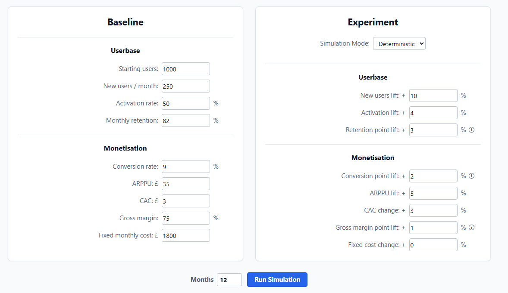
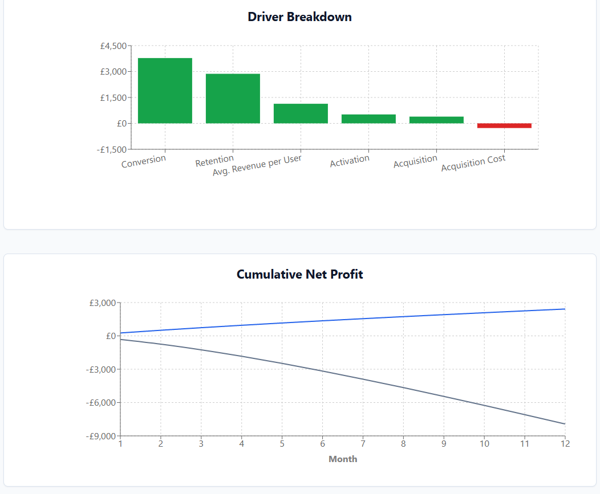
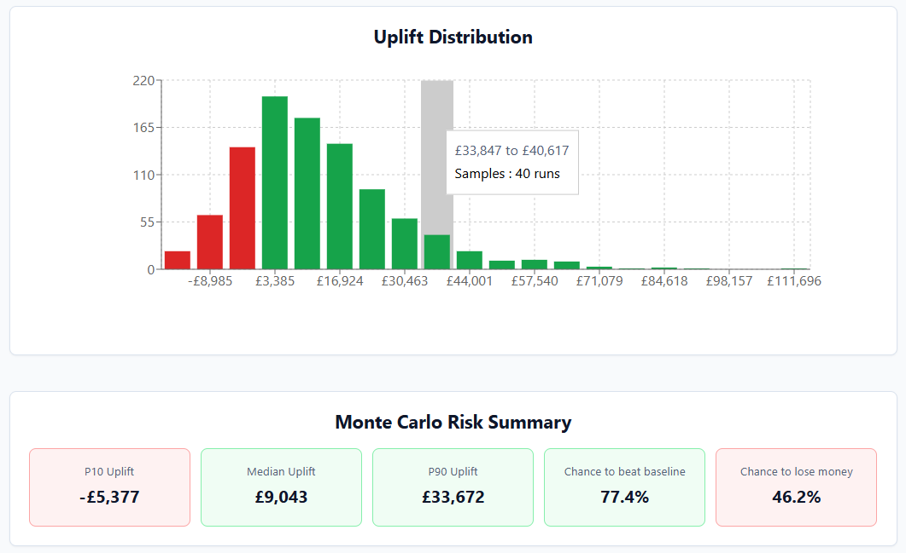

# Business Experiment Simulator

A small decision-support tool for comparing a product baseline with a proposed experiment. It models acquisition, activation, retention, conversion, revenue and costs over time, then presents deterministic forecasts and Monte Carlo risk estimates.

The model is intentionally transparent. It is useful for testing assumptions and comparing scenarios, not as a substitute for measured data or a forecasting system trained on historical outcomes.





## What it does

- Projects baseline and experiment performance over 1 to 72 months
- Charts active users, paying users, monthly profit and cumulative profit
- Estimates the isolated sensitivity of profit to each changed input
- Samples uncertain experiment inputs from triangular distributions
- Reports P10, median and P90 profit uplift
- Reports the probability of beating baseline and the probability of losing money
- Validates request and response shapes through FastAPI and Pydantic

## Model

For each month:

```text
retained users = previous active users * retention rate
activated users = new users * activation rate
active users = retained users + activated users
paying users = active users * conversion rate
revenue = paying users * average revenue per paying user
net profit = revenue * gross margin - acquisition cost - fixed cost
```

Acquisition, activation, average revenue per paying user, acquisition cost and fixed cost changes are multiplicative. Retention, conversion and gross margin changes are percentage-point changes. Probability-like rates are clamped to the range from zero to one, while monetary and user-count inputs cannot fall below zero.

The driver breakdown is a one-factor sensitivity view. Each changed input is applied independently against the baseline and ranked by absolute profit impact. It is not causal attribution and does not divide interaction effects between drivers.

## Monte Carlo mode

Each uncertain experiment input is described by a minimum, expected and maximum value. Every run samples each input independently from a triangular distribution, applies that sampled scenario across the full forecast period and compares it with the deterministic baseline.

Current assumptions:

- Input distributions are independent
- The expected value is the mode of each triangular distribution
- A sampled scenario stays constant throughout one run
- "Chance to lose money" means absolute experiment profit below zero
- Results describe the supplied assumptions; they do not infer uncertainty from historical data

## Architecture

- **Frontend:** React, TypeScript, Vite and Recharts
- **Backend:** Python, FastAPI and Pydantic
- **Contract:** JSON request and response models at `/simulate` and `/simulate-monte-carlo`
- **Quality checks:** pytest, ESLint, TypeScript compilation and a production Vite build in GitHub Actions

## Local setup

Start the API:

```powershell
cd backend
python -m venv .venv
.\.venv\Scripts\Activate.ps1
python -m pip install -r requirements-dev.txt
python -m uvicorn app.main:app --reload
```

Start the frontend in a second terminal:

```powershell
cd frontend
npm install
npm run dev
```

The frontend uses `http://127.0.0.1:8000` by default. Copy `frontend/.env.example` to `frontend/.env` to set another API URL. Set `FRONTEND_ORIGIN` for the API when the browser origin is not `http://localhost:5173`.

## Verification

```powershell
cd backend
python -m pytest

cd ..\frontend
npm run lint
npm run build
```
